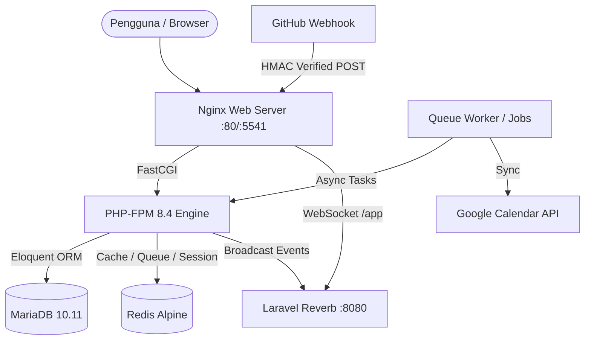

# 🏗️ Architecture, Health Probes & Operations Guide

Panduan menyeluruh mengenai arsitektur sistem Swap Hub, endpoint health & readiness probe untuk orkestrasi container, modul administrasi sistem, dan standar keamanan operasional.

---

## 1. Topologi Arsitektur Sistem

Swap Hub dibangun dengan model layanan terpadu (*monolith with reactive components*) menggunakan stack modern:



### Komponen Inti:
1. **Application Runtime:** PHP 8.4, Laravel 12.
2. **Reactivity & Frontend:** Livewire 3, Alpine.js, Tailwind CSS (dikompilasi oleh Vite).
3. **Database:** MariaDB 10.11 (Production/Dev), SQLite in-memory (Testing).
4. **Caching & Asynchronous Processing:** Redis (driver antrean queue, cache aplikasi, dan session store).
5. **Real-time WebSockets:** Laravel Reverb self-hosted daemon.

---

## 2. Health & Readiness Probes

Aplikasi menyediakan dua probe HTTP standar untuk integrasi Kubernetes, Docker Compose healthcheck, atau load balancer:

### 2.1 Liveness Probe (`GET /healthz`)
- **Tujuan**: Memverifikasi bahwa proses web server dan PHP-FPM dapat merespons permintaan HTTP secara normal.
- **Autentikasi**: Publik (tanpa autentikasi).
- **Format Respons (HTTP 200)**:
  ```json
  {
    "status": "ok",
    "timestamp": "2026-10-04T12:00:00+00:00"
  }
  ```

### 2.2 Readiness Probe (`GET /readyz`)
- **Tujuan**: Memastikan keterhubungan ke seluruh dependensi kritis (MariaDB dan Redis) sebelum lalu lintas user dialihkan.
- **Logika Pengecekan**:
  1. Koneksi MariaDB via `DB::connection()->getPdo()`.
  2. Ping Redis via `Redis::connection()->ping()`.
- **Status Sehat (HTTP 200)**:
  ```json
  {
    "status": "ready",
    "checks": {
      "database": "ok",
      "redis": "ok"
    },
    "timestamp": "2026-10-04T12:00:00+00:00"
  }
  ```
- **Status Terdegradasi (HTTP 503)**:
  ```json
  {
    "status": "degraded",
    "checks": {
      "database": "ok",
      "redis": "failed: Connection refused"
    },
    "timestamp": "2026-10-04T12:00:00+00:00"
  }
  ```

---

## 3. Administrasi & Manajemen Sistem

Area admin dilindungi oleh middleware gabungan `['auth', 'admin']` pada prefix `/admin`:

### 3.1 Manajemen Pengguna (`/admin/users`)
- Menampilkan seluruh mahasiswa terdaftar, status verifikasi email, dan reputasi.
- **Toggle Role Admin** (`POST /admin/users/{user}/toggle-role`): Mengubah hak akses pengguna biasa menjadi administrator platform secara instan.

### 3.2 Moderasi Proyek (`/admin/projects`)
- Daftar seluruh proyek kolaborasi mahasiswa.
- **Arsip Proyek** (`POST /admin/projects/{project}/archive`): Mengarsipkan proyek yang melanggar kebijakan atau telah nonaktif tanpa menghapus data historis.

### 3.3 Dashboard Live System Health (`/admin/system-health`)
Komponen reaktif Livewire `App\Livewire\SystemHealth` yang mengukur status infrastruktur secara real-time:
1. **Database Connection & Latency**: Menghitung waktu latensi round-trip query database dalam milidetik (ms).
2. **Web Server Status**: Menampilkan status runtime PHP-FPM.
3. **Reverb WebSocket Probe**: Melakukan koneksi socket via `fsockopen` ke daemon Reverb untuk memastikan socket listener aktif menerima koneksi chat.

---

## 4. Keamanan & Hardening

1. **CSRF Exemption & Signature Verification**:
   - Rute webhook GitHub (`/webhooks/github`) dikecualikan dari proteksi token CSRF di `bootstrap/app.php`.
   - Integritas webhook divalidasi ketat menggunakan tanda tangan digital **HMAC-SHA256** (`X-Hub-Signature-256`) terhadap `GITHUB_WEBHOOK_SECRET` melalui `App\Services\GitHubWebhookService`.
2. **Isolasi File Storage di Nginx**:
   - Seluruh eksekusi file script `.php` di direktori `storage/` dan `uploads/` diblokir permanen oleh konfigurasi Nginx (`location ~* ^/(?:storage|uploads)/.*\.php$ { deny all; }`).
   - File konfigurasi tersembunyi (dotfiles seperti `.env`) ditolak aksesnya secara default.
3. **Penyimpanan Password**:
   - Hashing menggunakan Bcrypt dengan *cost factor* 12 rounds (`BCRYPT_ROUNDS=12`).
4. **Isolasi Hak Akses Docker**:
   - Container memisahkan kepemilikan direktori `storage` dan `bootstrap/cache` di bawah pengguna non-root `www-data`.
