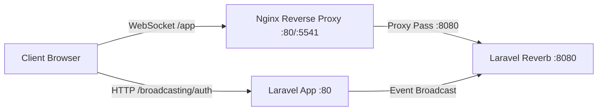

# ⚡ WebSocket & Real-Time Chat Guide (Laravel Reverb)

Panduan teknis dan operasional implementasi real-time broadcasting pada Swap Hub menggunakan **Laravel Reverb** (WebSocket server mandiri/self-hosted) dan **Laravel Echo**.

---

## 1. Arsitektur Real-Time



- **Broadcaster:** `laravel/reverb` (menggantikan kebutuhan vendor pihak ketiga seperti Pusher Cloud).
- **Reverse Proxy:** Nginx mem-proxy koneksi WebSocket path `/app` dan `/apps` langsung ke daemon Reverb internal di port `8080`.
- **Frontend Client:** `laravel-echo` + `pusher-js` yang dikonfigurasi pada `resources/js/echo.js`.

---

## 2. Konfigurasi Environment (`.env`)

### 2.1 Backend Server
```env
BROADCAST_CONNECTION=reverb

REVERB_APP_ID=554101
REVERB_APP_KEY=swaphubreverbkey
REVERB_APP_SECRET=swaphubreverbsecret
REVERB_HOST="127.0.0.1"
REVERB_PORT=8080
REVERB_SCHEME=http
```

### 2.2 Frontend Client (Vite)
Klien web mengakses Reverb melalui port publik aplikasi (Nginx):
```env
VITE_REVERB_APP_KEY="${REVERB_APP_KEY}"
VITE_REVERB_HOST="localhost"
VITE_REVERB_PORT=5541
VITE_REVERB_SCHEME="http"
```
*Catatan untuk Production:* Jika menggunakan HTTPS, ubah `VITE_REVERB_PORT=443` dan `VITE_REVERB_SCHEME="https"`.

---

## 3. Daemon & Supervisor di Docker

Pada environment Docker, daemon Reverb dijalankan secara otomatis saat container `app` booting melalui `docker/entrypoint.sh`:

```sh
# docker/entrypoint.sh
su-exec www-data php artisan reverb:start --host=0.0.0.0 --port=8080 >> /var/www/storage/logs/reverb.log 2>&1
```

Log aktivitas dan error WebSocket disimpan terpisah di `storage/logs/reverb.log`.

### Konfigurasi Nginx (`docker/nginx/conf.d/app.conf`)
Nginx menangani upgrade protokol HTTP ke WebSocket:
```nginx
location /app {
    proxy_http_version 1.1;
    proxy_set_header Host $http_host;
    proxy_set_header Scheme $scheme;
    proxy_set_header SERVER_PORT $server_port;
    proxy_set_header REMOTE_ADDR $remote_addr;
    proxy_set_header X-Forwarded-For $proxy_add_x_forwarded_for;
    proxy_set_header Upgrade $http_upgrade;
    proxy_set_header Connection "Upgrade";

    proxy_pass http://127.0.0.1:8080;
}
```

---

## 4. Channel & Otorisasi (`routes/channels.php`)

Swap Hub menggunakan dua private channel utama:

### 4.1 User Private Channel (`App.Models.User.{id}`)
- **Tujuan**: Mengirimkan notifikasi pesan baru dan badge unread counter ke navbar user secara individual.
- **Otorisasi**:
  ```php
  Broadcast::channel('App.Models.User.{id}', function ($user, $id) {
      return (int) $user->id === (int) $id;
  });
  ```

### 4.2 Chat Conversation Channel (`chat.{conversationId}`)
- **Tujuan**: Siaran pesan real-time dalam ruang obrolan (Direct Chat maupun Project Chat).
- **Otorisasi**:
  ```php
  Broadcast::channel('chat.{conversationId}', function ($user, $conversationId) {
      $conversation = \App\Models\Conversation::find($conversationId);
      if (! $conversation) return false;

      // Izinkan jika user adalah partisipan langsung (direct chat)
      if ($conversation->participants()->where('user_id', $user->id)->exists()) {
          return true;
      }

      // Izinkan jika user adalah anggota aktif atau pemilik proyek
      if ($conversation->type === 'project' && $conversation->project) {
          return $conversation->project->activeMembers()->where('user_id', $user->id)->exists()
              || $conversation->project->owner_id === $user->id;
      }

      return false;
  });
  ```

---

## 5. Event Broadcasting (`MessageSent`)

Pesan baru dibroadcast menggunakan event `App\Events\MessageSent`:
- Mengimplementasikan `ShouldBroadcastNow` agar terkirim seketika tanpa jeda antrean queue database.
- Menyiarkan data pada private channel `chat.{conversation.id}` dengan event name `.message.sent`.
- Digunakan oleh:
  1. Pengiriman pesan user di `App\Livewire\Chat\ChatPage`.
  2. Notifikasi otomatis commit/push GitHub di `App\Http\Controllers\GitHubWebhookController`.

---

## 6. Operasional & Monitoring

### 6.1 Memeriksa Status Reverb
Status Reverb dapat dipantau langsung melalui Admin Dashboard pada menu **System Health** (`/admin/system-health`). Health checker melakukan socket probe langsung ke host & port Reverb.

### 6.2 Memeriksa Log Reverb
```bash
# Periksa log WebSocket di dalam Docker
docker compose exec app tail -n 50 /var/www/storage/logs/reverb.log
```

### 6.3 Restart Manual Daemon Reverb
Jika konfigurasi `.env` Reverb diubah:
```bash
docker compose restart app
```
Atau restart proses artisan reverb di dalam container:
```bash
docker compose exec app pkill -f "artisan reverb:start"
# Loop supervisor pada entrypoint.sh akan otomatis menjalankan ulang daemon
```

---

## 7. Troubleshooting

1. **Error WebSocket connection to 'ws://localhost:5541/app/...' failed**:
   - Pastikan port `5541` (atau port `APP_PORT` Anda) dapat diakses dari browser.
   - Periksa apakah daemon Reverb aktif: `docker compose exec app ps aux | grep reverb`.
   - Pastikan `VITE_REVERB_PORT` dan `VITE_REVERB_HOST` di `.env` sesuai dengan URL browser Anda.
2. **Pesan 403 Forbidden pada `/broadcasting/auth`**:
   - Masalah otorisasi CSRF atau cookie sesi. Pastikan user sudah login dan terverifikasi.
   - Periksa logika di `routes/channels.php` apakah user terdaftar pada percakapan/proyek terkait.
3. **Pesan muncul di database tetapi tidak realtime di browser lawan bicara**:
   - Periksa console browser (F12) untuk melihat apakah ada event `message.sent` yang tertangkap oleh Echo listener.
